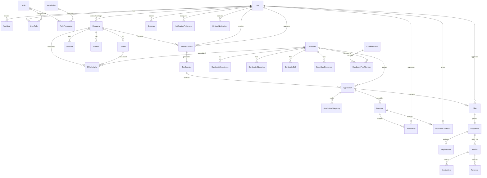

# Tashgheel HRMS — Entity Relationship Diagram (ERD)

**Version:** 1.0  
**Date:** 2025  
**Product:** Tashgheel HRMS  
**Architecture:** Single-Tenant  

---

## 1. Mermaid ERD Diagram

---

## 2. Table Specifications

### 2.1 Identity & RBAC

#### User
*Represents internal staff members (recruiters, managers, admins, finance users).*
- `id` (UUID, PK)
- `email` (VARCHAR, Unique)
- `passwordHash` (VARCHAR)
- `firstName` (VARCHAR)
- `lastName` (VARCHAR)
- `avatarUrl` (VARCHAR, Optional)
- `status` (ENUM: ACTIVE, DEACTIVATED)
- `createdAt` (TIMESTAMP)
- `updatedAt` (TIMESTAMP)

#### Role
*Represents system-defined security roles.*
- `id` (UUID, PK)
- `name` (VARCHAR, Unique)
- `description` (VARCHAR)
- `createdAt` (TIMESTAMP)

#### Permission
*Represents granular security actions.*
- `id` (VARCHAR, PK) -- e.g., "candidates:write"
- `description` (VARCHAR)

#### UserRole
*Many-to-many junction for Users and Roles.*
- `userId` (UUID, FK -> User, PK)
- `roleId` (UUID, FK -> Role, PK)

#### RolePermission
*Many-to-many junction for Roles and Permissions.*
- `roleId` (UUID, FK -> Role, PK)
- `permissionId` (VARCHAR, FK -> Permission, PK)

#### AuditLog
*Immutable record of system activities.*
- `id` (UUID, PK)
- `userId` (UUID, FK -> User, Optional)
- `action` (VARCHAR) -- e.g., "CREATE", "UPDATE", "DELETE"
- `resource` (VARCHAR) -- e.g., "Candidate", "Company"
- `resourceId` (VARCHAR)
- `beforeValue` (JSON, Optional)
- `afterValue` (JSON, Optional)
- `ipAddress` (VARCHAR, Optional)
- `userAgent` (VARCHAR, Optional)
- `createdAt` (TIMESTAMP)

---

### 2.2 CRM Module

#### Company
*Represents client corporations.*
- `id` (UUID, PK)
- `name` (VARCHAR, Unique)
- `industry` (VARCHAR, Optional)
- `website` (VARCHAR, Optional)
- `accountManagerId` (UUID, FK -> User, Optional)
- `status` (ENUM: ACTIVE, INACTIVE, BLACKLISTED)
- `deletedAt` (TIMESTAMP, Optional) -- Soft delete
- `createdAt` (TIMESTAMP)
- `updatedAt` (TIMESTAMP)

#### Contact
*Represents specific contact people at client companies.*
- `id` (UUID, PK)
- `companyId` (UUID, FK -> Company)
- `firstName` (VARCHAR)
- `lastName` (VARCHAR)
- `title` (VARCHAR, Optional)
- `email` (VARCHAR, Optional)
- `phone` (VARCHAR, Optional)
- `linkedinUrl` (VARCHAR, Optional)
- `isPrimary` (BOOLEAN, Default: false)
- `createdAt` (TIMESTAMP)
- `updatedAt` (TIMESTAMP)

#### Contract
*Represents legal/commercial agreements with client companies.*
- `id` (UUID, PK)
- `companyId` (UUID, FK -> Company)
- `contractNumber` (VARCHAR, Unique)
- `fileUrl` (VARCHAR) -- Cloudflare R2 path
- `startDate` (DATE)
- `endDate` (DATE, Optional)
- `status` (ENUM: DRAFT, ACTIVE, EXPIRED, TERMINATED)
- `createdAt` (TIMESTAMP)
- `updatedAt` (TIMESTAMP)

#### Branch
*Represents physical locations of a client company.*
- `id` (UUID, PK)
- `companyId` (UUID, FK -> Company)
- `name` (VARCHAR)
- `address` (VARCHAR)
- `city` (VARCHAR)
- `country` (VARCHAR)
- `createdAt` (TIMESTAMP)

#### CRMActivity
*Polymorphic log of actions taken with Companies or Candidates.*
- `id` (UUID, PK)
- `type` (ENUM: CALL, MEETING, NOTE, TASK, FOLLOW_UP, EMAIL)
- `subject` (VARCHAR)
- `content` (TEXT)
- `userId` (UUID, FK -> User)
- `companyId` (UUID, FK -> Company, Optional)
- `contactId` (UUID, FK -> Contact, Optional)
- `candidateId` (UUID, FK -> Candidate, Optional)
- `dueDate` (TIMESTAMP, Optional)
- `isCompleted` (BOOLEAN, Default: false)
- `createdAt` (TIMESTAMP)

---

### 2.3 ATS Module (Jobs & Candidates)

#### JobRequisition
*Internal request to hire for a role.*
- `id` (UUID, PK)
- `title` (VARCHAR)
- `department` (VARCHAR)
- `companyId` (UUID, FK -> Company)
- `location` (VARCHAR)
- `type` (ENUM: FULL_TIME, PART_TIME, CONTRACT, TEMPORARY, INTERNSHIP)
- `salaryMin` (DECIMAL, Optional)
- `salaryMax` (DECIMAL, Optional)
- `descriptionEn` (TEXT)
- `descriptionAr` (TEXT, Optional)
- `requirementsEn` (TEXT)
- `requirementsAr` (TEXT, Optional)
- `deadline` (DATE, Optional)
- `status` (ENUM: DRAFT, PENDING_APPROVAL, APPROVED, REJECTED)
- `creatorId` (UUID, FK -> User)
- `approverId` (UUID, FK -> User, Optional)
- `rejectionReason` (VARCHAR, Optional)
- `createdAt` (TIMESTAMP)
- `updatedAt` (TIMESTAMP)

#### JobOpening
*Active job positions based on approved requisitions.*
- `id` (UUID, PK)
- `requisitionId` (UUID, FK -> JobRequisition, Unique)
- `companyId` (UUID, FK -> Company)
- `title` (VARCHAR)
- `status` (ENUM: OPEN, ON_HOLD, CLOSED, FILLED)
- `openedAt` (TIMESTAMP)
- `closedAt` (TIMESTAMP, Optional)
- `createdAt` (TIMESTAMP)
- `updatedAt` (TIMESTAMP)

#### Candidate
*Represents candidate profiles.*
- `id` (UUID, PK)
- `firstName` (VARCHAR)
- `lastName` (VARCHAR)
- `email` (VARCHAR, Unique, Optional)
- `phone` (VARCHAR, Optional)
- `linkedinUrl` (VARCHAR, Optional)
- `nationality` (VARCHAR, Optional)
- `currentLocation` (VARCHAR, Optional)
- `expectedSalary` (DECIMAL, Optional)
- `availability` (ENUM: AVAILABLE, NOTICE_PERIOD, EMPLOYED, UNAVAILABLE)
- `source` (VARCHAR, Optional) -- e.g., LinkedIn, Referral
- `deletedAt` (TIMESTAMP, Optional) -- Soft delete
- `createdAt` (TIMESTAMP)
- `updatedAt` (TIMESTAMP)
- `embedding` (VECTOR(1536), Optional) -- pgvector for semantic search
- `aiSummary` (TEXT, Optional)

#### CandidateExperience
- `id` (UUID, PK)
- `candidateId` (UUID, FK -> Candidate)
- `companyName` (VARCHAR)
- `title` (VARCHAR)
- `startDate` (DATE)
- `endDate` (DATE, Optional)
- `isCurrent` (BOOLEAN, Default: false)
- `description` (TEXT, Optional)

#### CandidateEducation
- `id` (UUID, PK)
- `candidateId` (UUID, FK -> Candidate)
- `institution` (VARCHAR)
- `degree` (VARCHAR)
- `fieldOfStudy` (VARCHAR, Optional)
- `startDate` (DATE)
- `endDate` (DATE, Optional)

#### CandidateSkill
- `id` (UUID, PK)
- `candidateId` (UUID, FK -> Candidate)
- `skillName` (VARCHAR)
- `proficiency` (ENUM: BEGINNER, INTERMEDIATE, ADVANCED, EXPERT)

#### CandidateDocument
- `id` (UUID, PK)
- `candidateId` (UUID, FK -> Candidate)
- `type` (ENUM: CV, CERTIFICATE, PORTFOLIO, OTHER)
- `fileName` (VARCHAR)
- `fileUrl` (VARCHAR) -- Cloudflare R2 path
- `createdAt` (TIMESTAMP)

#### CandidatePool
- `id` (UUID, PK)
- `name` (VARCHAR)
- `description` (TEXT, Optional)
- `creatorId` (UUID, FK -> User)
- `createdAt` (TIMESTAMP)

#### CandidatePoolMember
- `poolId` (UUID, FK -> CandidatePool, PK)
- `candidateId` (UUID, FK -> Candidate, PK)

---

### 2.4 Recruitment Pipeline

#### Application
*Tracks a candidate's application for a job opening.*
- `id` (UUID, PK)
- `candidateId` (UUID, FK -> Candidate)
- `jobOpeningId` (UUID, FK -> JobOpening)
- `recruiterId` (UUID, FK -> User)
- `stage` (ENUM: NEW_APPLICATION, SCREENING, HR_INTERVIEW, TECHNICAL_INTERVIEW, ASSESSMENT, OFFER, PLACEMENT, REJECTED, WITHDRAWN)
- `createdAt` (TIMESTAMP)
- `updatedAt` (TIMESTAMP)

#### ApplicationStageLog
*Tracks historical movements in the recruitment stages.*
- `id` (UUID, PK)
- `applicationId` (UUID, FK -> Application)
- `fromStage` (VARCHAR, Optional)
- `toStage` (VARCHAR)
- `note` (TEXT, Optional)
- `userId` (UUID, FK -> User)
- `createdAt` (TIMESTAMP)

---

### 2.5 Interviews & Offers

#### Interview
- `id` (UUID, PK)
- `applicationId` (UUID, FK -> Application)
- `type` (ENUM: HR, TECHNICAL, FINAL, ASSESSMENT, CLIENT)
- `scheduledAt` (TIMESTAMP)
- `location` (VARCHAR, Optional)
- `videoLink` (VARCHAR, Optional)
- `status` (ENUM: SCHEDULED, COMPLETED, CANCELLED, RESCHEDULED)
- `cancellationReason` (VARCHAR, Optional)
- `createdAt` (TIMESTAMP)

#### Interviewer
*Junction table for system users assigned to an interview.*
- `interviewId` (UUID, FK -> Interview, PK)
- `userId` (UUID, FK -> User, PK)

#### InterviewFeedback
- `id` (UUID, PK)
- `interviewId` (UUID, FK -> Interview)
- `interviewerId` (UUID, FK -> User)
- `recommendation` (ENUM: HIRE, HOLD, REJECT)
- `notes` (TEXT, Optional)
- `competencyRatings` (JSON) -- Structured skill ratings (1-5 scale)
- `createdAt` (TIMESTAMP)

#### Offer
- `id` (UUID, PK)
- `applicationId` (UUID, FK -> Application)
- `salaryAmount` (DECIMAL)
- `currency` (VARCHAR) -- e.g., "USD", "SAR"
- `benefits` (TEXT, Optional)
- `startDate` (DATE)
- `expiryDate` (DATE)
- `status` (ENUM: DRAFT, PENDING_APPROVAL, APPROVED, SENT, ACCEPTED, REJECTED, EXPIRED)
- `rejectionReason` (VARCHAR, Optional)
- `creatorId` (UUID, FK -> User)
- `approverId` (UUID, FK -> User, Optional)
- `createdAt` (TIMESTAMP)
- `updatedAt` (TIMESTAMP)

---

### 2.6 Placement & Replacement

#### Placement
- `id` (UUID, PK)
- `offerId` (UUID, FK -> Offer, Unique)
- `applicationId` (UUID, FK -> Application)
- `startDate` (DATE)
- `feeAmount` (DECIMAL)
- `feeType` (ENUM: FIXED, PERCENTAGE)
- `guaranteeDays` (INTEGER, Default: 90)
- `guaranteeEndDate` (DATE)
- `guaranteeStatus` (ENUM: ACTIVE, AT_RISK, EXPIRED, VOIDED)
- `status` (ENUM: ACTIVE, GUARANTEE_PERIOD, COMPLETED, REPLACED)
- `createdAt` (TIMESTAMP)
- `updatedAt` (TIMESTAMP)

#### Replacement
- `id` (UUID, PK)
- `placementId` (UUID, FK -> Placement)
- `replacementCandidateId` (UUID, FK -> Candidate, Optional)
- `reason` (ENUM: PERFORMANCE, CULTURAL_FIT, RESIGNATION, TERMINATION, MEDICAL, OTHER)
- `detailNotes` (TEXT, Optional)
- `status` (ENUM: REQUESTED, IN_PROGRESS, COMPLETED)
- `createdAt` (TIMESTAMP)
- `completedAt` (TIMESTAMP, Optional)

---

### 2.7 Finance Module

#### Invoice
- `id` (UUID, PK)
- `placementId` (UUID, FK -> Placement, Optional)
- `invoiceNumber` (VARCHAR, Unique) -- e.g., INV-2025-001
- `companyId` (UUID, FK -> Company)
- `issueDate` (DATE)
- `dueDate` (DATE)
- `subtotal` (DECIMAL)
- `vatAmount` (DECIMAL)
- `totalAmount` (DECIMAL)
- `status` (ENUM: DRAFT, SENT, PARTIALLY_PAID, PAID, OVERDUE, CANCELLED)
- `cancellationReason` (VARCHAR, Optional)
- `createdAt` (TIMESTAMP)
- `updatedAt` (TIMESTAMP)

#### InvoiceItem
- `id` (UUID, PK)
- `invoiceId` (UUID, FK -> Invoice)
- `description` (VARCHAR)
- `quantity` (INTEGER)
- `unitPrice` (DECIMAL)
- `totalPrice` (DECIMAL)

#### Payment
- `id` (UUID, PK)
- `invoiceId` (UUID, FK -> Invoice)
- `amount` (DECIMAL)
- `paymentDate` (DATE)
- `paymentMethod` (ENUM: BANK_TRANSFER, CHECK, CASH, CREDIT_CARD)
- `referenceNumber` (VARCHAR, Optional)
- `createdAt` (TIMESTAMP)

#### Expense
- `id` (UUID, PK)
- `category` (ENUM: OFFICE, TRAVEL, MARKETING, SOFTWARE, UTILITIES, OTHER)
- `description` (VARCHAR)
- `amount` (DECIMAL)
- `expenseDate` (DATE)
- `recordedById` (UUID, FK -> User)
- `createdAt` (TIMESTAMP)

---

### 2.8 Notifications & Preferences

#### NotificationPreference
- `userId` (UUID, FK -> User, PK)
- `type` (VARCHAR, PK) -- e.g., "GUARANTEE_EXPIRY", "INVOICE_OVERDUE"
- `emailEnabled` (BOOLEAN, Default: true)
- `inAppEnabled` (BOOLEAN, Default: true)

#### SystemNotification
- `id` (UUID, PK)
- `userId` (UUID, FK -> User)
- `type` (VARCHAR)
- `title` (VARCHAR)
- `message` (TEXT)
- `isRead` (BOOLEAN, Default: false)
- `metadata` (JSON, Optional)
- `createdAt` (TIMESTAMP)
